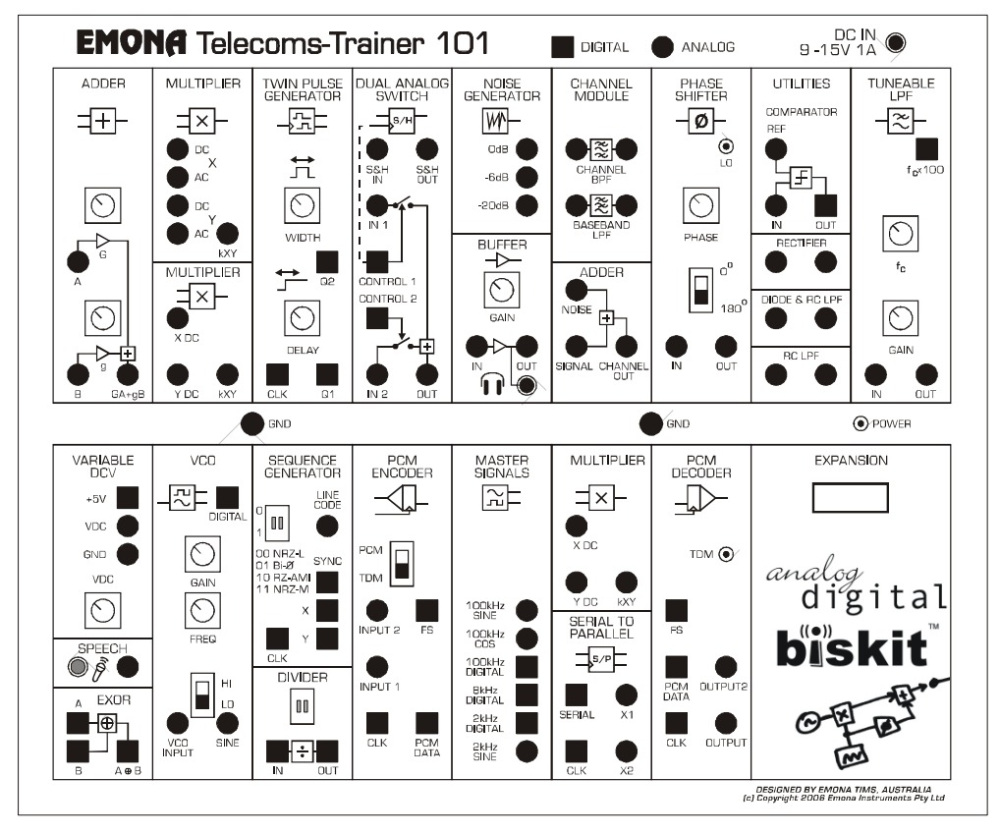
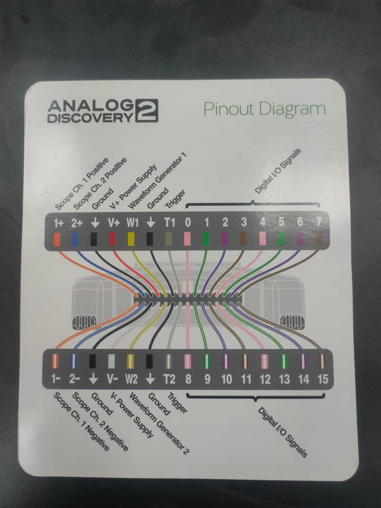

# ⚡ Telecoms-Trainer 101 Simulator (Omarator)

[](https://react.dev/)
[](https://www.typescriptlang.org/)
[](https://vitejs.dev/)
[](https://developer.mozilla.org/en-US/docs/Web/API/Web_Audio_API)
[](https://opensource.org/licenses/MIT)

A modern, interactive, virtual simulation of the **EMONA Telecoms-Trainer 101 (BiSKIT)** telecommunications laboratory workstation. Designed for engineering students, professors, and electronics hobbyists to build and analyze real-time analog and digital communication systems directly in the browser with zero external hardware required.

---

## 📸 Hardware Reference & Panel Schematics

| EMONA Telecoms-Trainer 101 Front Panel | Digilent Analog Discovery 2 Pinout |
| :---: | :---: |
|  |  |

---

## 🌟 Key Features

### 🎛️ Authentic 17-Module Trainer Board
Full vector schematic recreation of the EMONA ETT-101 hardware panel:
- **Top Row**: 
  - **Adder**: Dual-input linear summing amplifier ($GA + gB$) with variable gain controls.
  - **Multiplier Modules**: Four-quadrant analog/digital multipliers with $X_{DC}$ and $Y_{DC}$ offsets.
  - **Twin Pulse Generator**: $Q1/Q2$ pulses with adjustable delay and pulse-width.
  - **Dual Analog Switch**: Natural PAM sampling and Sample-and-Hold ($S/H$) flat-top gating.
  - **Noise Generator & Audio Buffer**: $0\text{ dB}$, $-6\text{ dB}$, $-20\text{ dB}$ noise sources and 3.5mm headphone amplifier.
  - **Channel Module**: Bandpass Filter (BPF), Baseband LPF, and Channel Summing Adder.
  - **Phase Shifter**: $0^\circ / 180^\circ$ inversion switch with fine $0^\circ \dots 180^\circ$ rotary control.
  - **Utilities**: Voltage Comparator (Schmitt trigger), Half-wave Rectifier, Diode LPF, and RC LPF.
  - **Tuneable LPF**: 4th-order active filter with adjustable cut-off ($f_c \times 100$) and gain.
- **Central Ground Rail**: Standard grounding jacks with polarity protection.
- **Bottom Row**:
  - **Variable DCV & Mic / EXOR**: Continuous $-2.5\text{V} \dots +2.5\text{V}$ DC source, speech mic capsule, and XOR logic gate.
  - **VCO (Voltage Controlled Oscillator)**: Sine & Digital square outputs with $LO / HI$ frequency bands.
  - **Sequence Generator & Divider**: Pseudo-Random Bit Sequence (PRBS) generator with NRZ-L, Bi-$\varnothing$ Manchester, RZ-AMI, and NRZ-M line codes.
  - **PCM Encoder**: 8-bit quantization with Frame Synchronization ($FS$) pulses.
  - **Master Signals**: High-stability $100\text{kHz}$ Sine/Cosine/Digital, $8\text{kHz}$ Digital, and $2\text{kHz}$ Sine/Digital clocks.
  - **Multiplier & Serial-to-Parallel ($S/P$)**: Digital deserializer module.
  - **PCM Decoder**: 8-bit D/A conversion with staircase PAM output reconstruction.
  - **Expansion Bay**: Expansion slot simulation.

---

### 🔌 Interactive Patch Cord Routing
- **Snap-to-Jack Wiring**: Click or drag between digital (square) and analog (circular) jacks.
- **Auto Color Coding**: Visual contrast with realistic wire curves and intersection management.
- **One-Click Deletion**: Right-click or touch-hold to disconnect individual patch cords.

---

### 📊 Real-Time Dual-Trace Oscilloscope
- **Dual Channels**: High-visibility Channel 1 (Cyan) and Channel 2 (Orange/Red) traces.
- **Controls**:
  - $TIME/DIV$: $10\,\mu\text{s} \dots 50\,\text{ms}$ per division.
  - $VOLTS/DIV$: $100\,\text{mV} \dots 5\,\text{V}$ per division with independent CH1/CH2 position offsets.
  - **Trigger Modes**: $AUTO$, $NORM$, $SINGLE$, and $EXT$ triggering (e.g., Sequence Generator $SYNC$).
  - **Canvas Touch/Pan**: Drag oscilloscope waveform display horizontally and vertically.

---

### 🧪 Embedded Lab Experiments Hub (Labs 1 – 4)
Integrated step-by-step guidance and authentic EMONA student manuals:
1. **Lab 1 — Sampling & Reconstruction (Exp 11)**:
   - Part A1: Natural Sampling (Dual Analog Switch)
   - Part A2: Flat-Top Sampling (Sample-and-Hold)
   - Part C: Message Recovery via Tuneable LPF
   - Part D: Aliasing & Nyquist Rate Verification
2. **Lab 2 — PCM Encoding (Exp 12)**:
   - Part A: Static DC ($0\text{V}$) & 8-Bit Frame Structure
   - Part B: Variable DC Voltage Encoding ($-2.5\text{V} \dots +2.5\text{V}$)
   - Part C: AC Sinewave Dynamic PCM Encoding
3. **Lab 3 — PCM Decoding (Exp 13)**:
   - Part A: PCM Encoder Verification
   - Part B: Encode–Decode Loop with Stolen Clock & Frame Sync
   - Part C: Staircase PAM Smoothing via Tuneable LPF
4. **Lab 4 — Bandwidth Limiting & Signal Restoration (Exp 14)**:
   - Part A: Digital Transmission through Bandwidth-Limited Channel (ISI)
   - Part B: Variable Bit Rate & Eye Diagram Generation
   - Part C: Digital Signal Restoration via Comparator Slicing

*Each lab includes **genuine high-resolution EMONA block diagrams** viewable directly in the card or expanded via a **centered Lightbox Modal** with zoom controls ($−$, $100\%$, $+$).*

---

### 📷 Lab Report Snapshot Utility (`[ 📷 SAVE AS PNG ]`)
- One-click snapshot compositing the **trainer board patch wiring** and the **live oscilloscope display** into a high-resolution ($1920\text{px}$) PNG file complete with timestamp and experiment details.

---

## 🚀 Quick Start

### Prerequisites
- [Node.js](https://nodejs.org/) (v18 or newer)
- `npm` / `yarn` / `pnpm`

### Installation & Local Development

```bash
# 1. Clone repository
git clone https://github.com/omaralaa7/telecoms-trainer-simulator-omarator.git

# 2. Navigate into the app workspace
cd telecoms-trainer-simulator-omarator/telecoms-app

# 3. Install project dependencies
npm install

# 4. Start local Vite development server
npm run dev
```

Visit `http://localhost:5173/` in your browser.

### Production Build

```bash
cd telecoms-app
npm run build
```
The optimized production bundle is output to `telecoms-app/dist/`.

---

## 🛠️ Architecture & Technologies

- **UI Framework**: React 19, TypeScript
- **Styling**: Modern Vanilla CSS, CSS Grid, Flexbox, Custom Design Tokens
- **State Management**: Zustand
- **Vector Graphics & Canvas**: SVG Patch Panel + HTML5 2D Canvas Scope Renderer
- **DSP Signal Synthesis**: Web Audio API (Oscillators, Biquad Filters, DSP Nodes)
- **Deployment**: GitHub Actions $\rightarrow$ GitHub Pages

---

## ⚖️ Educational Disclaimer

This simulator is an independent educational tool developed for university academic coursework, telecommunications laboratory training, and portfolio demonstration.

- **Emona Telecoms-Trainer 101 (ETT-101)**, **BiSKIT**, and **TIMS** are trademarks of **Emona Instruments Pty Ltd** (Sydney, Australia).
- **Analog Discovery 2** is a trademark of **Digilent, Inc.**
- This project is not affiliated with, endorsed by, or sponsored by Emona Instruments Pty Ltd or Digilent, Inc.

---

## 📄 License

Distributed under the **MIT License**. See `LICENSE` for details.
